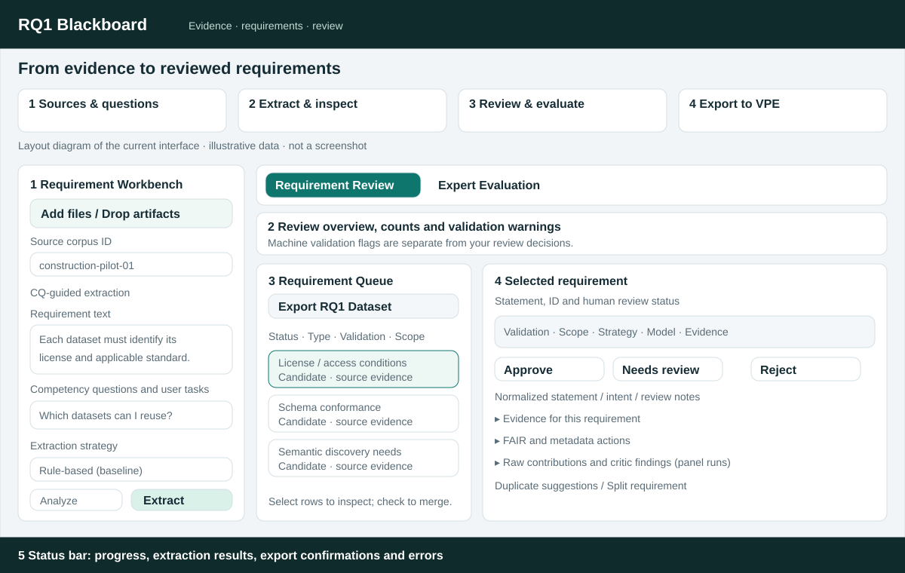

# RQ1 Blackboard: visual guide and operating instructions

This guide covers the standalone UI migrated from VPE. Start the app using the
[README setup instructions](../README.md#run-locally), then open
[the local workbench](http://127.0.0.1:8011). No VPE server is needed.

## What the interface looks like



*Layout schematic based on the current components, with illustrative content;
not a screenshot. The live interface scrolls and rearranges on smaller screens.*

| Area | What you see and do |
| --- | --- |
| Top workflow guide | Sources & questions → Extract & inspect → Review & evaluate → Export to VPE. These cards explain the workflow; use the controls below to perform it. |
| 1. Left input panel | Add files, identify the corpus, enter source text and user tasks, select a strategy, and run extraction. Selecting the multi-agent strategy reveals panel and role-context controls. |
| 2. Results overview | Counts of candidates, evidence and duplicate hints, plus machine-validation warnings. This appears after a run. |
| 3. Requirement Queue | Filter candidates, select a requirement, choose items to merge, and export the reviewed dataset. |
| 4. Selected requirement | Inspect the statement and source evidence; edit intent, FAIR annotations and candidate metadata actions; record review decisions and notes. Panel runs can also show raw contributions and critic findings. |
| Expert Evaluation tab | A separate coordinator/reviewer workflow for frozen machine output, independent submissions and consensus. |
| 5. Bottom status bar | Read progress, success messages, fallback notices and errors here. |

The current UI has an agent process graph and trace ledger. A persistent,
threaded discussion board is **not implemented yet**. The graph is a record of
the bounded workflow, not a live agent chat.

## First run: a small offline example

1. In **Source corpus ID**, enter `construction-pilot-01`.
2. Replace the prefilled **Requirement text** with the example below. This is
   synthetic practice material, not a research source:

   ```text
   Each dataset must carry a license or access rights statement.
   Dataset distributions should identify their format and schema version.
   ```

3. In **Competency questions and user tasks**, enter one question per line:

   ```text
   Which datasets can I reuse under an open license?
   Which distributions are compatible with my toolchain?
   ```

4. Keep **CQ-guided extraction** enabled and choose **Rule-based (baseline)**.
   This path works without model credentials.
5. Click **Extract**. Read the bottom status bar, then inspect the queue and
   validation warnings. Candidate counts depend on the input and strategy;
   they are not a quality score.
6. Click a candidate. Expand **Evidence for this requirement** and compare its
   statement with the displayed source text and locator.
7. Correct its statement or intent if needed, add **Review notes**, and choose
   **Approve**, **Needs review**, or **Reject**.
8. Click **Export RQ1 Dataset** above the queue. Keep the downloaded
   `rq1-requirement-dataset.json` before starting another run or reloading.

**Analyze** also runs the analysis/extraction pipeline and populates the results.
It is not a required preparatory step before **Extract**. Both initiate a new
run and replace the current candidate list and local merge/split history.

## Prepare your actual inputs

Use **Add files** or drop files into the left panel. Text entered in the main
box and uploaded artifacts are included together; clear the prefilled example
text before a real corpus run if you do not want it included.

Supported file inputs are text/Markdown, JSON (including AAS), AASX,
JSON-LD, Turtle/RDF/OWL and lightweight IFC/IFC-SPF. The picker accepts
`.txt`, `.md`, `.json`, `.aasx`, `.jsonld`, `.ttl`, `.rdf`, `.owl`, `.ifc`,
and `.ifcspf`. PDF, Word and Excel files are not directly supported by this UI.
Convert relevant passages to a supported text format and retain their original
source references in your research records.

Choose a stable corpus ID for your source packet. Enter predefined competency
questions or user tasks one per line. Lines ending in `?` are classified as
competency questions; other nonempty lines become user tasks. Lines beginning
with `#` are ignored. **CQ-guided extraction** records whether the run is guided
by those tasks.

Keep expert ratings, expected answers, gold requirements and post-run
corrections out of the extraction input. The input panel explicitly distinguishes
the source corpus from held-out evaluation material.

## Choose an extraction strategy

| UI option | Purpose | What to check |
| --- | --- | --- |
| Rule-based (baseline) | Deterministic baseline without a model. | Review the rule-generated candidates and evidence; this is not an LLM run. |
| LLM-assisted (verified evidence) | Model-assisted extraction with evidence checks. | Configure the provider/model locally and inspect evidence-verification flags. |
| Hybrid (LLM + rules) | Combines LLM and rule candidates. | Inspect deduplication, provenance and the actual strategy reported by the run. |
| Multi-agent panel (role-conditioned) | Independent roles, with consolidation and critics depending on the preset. | Inspect panel status, role failures and the trace ledger. |

Configure provider settings in the local `.env` file as described in
[the README](../README.md#run-locally), then restart the server. There is no
API-key or model-configuration form in the UI. Without a configured provider,
model-based requests can fall back to rules; use the reported strategy and
warnings to distinguish fallback from an actual model result. An explicitly
configured mock provider is only a test/demo condition.

## Inspect, edit and review requirements

Use the queue's **Status**, **Type**, **Validation** and **Scope** filters to
reduce the list. Clicking a row opens its detail panel.

The machine-metadata strip shows validation, scope, strategy, model, evidence
verification, source count, support classification, agent support and whether
the record is frozen. **Valid** means machine checks passed; it does not mean a
human has approved the requirement. A quoted passage can be verified as present
without necessarily justifying the proposed requirement.

| Human status/action | How to use it |
| --- | --- |
| Candidate | Newly extracted item awaiting your decision. |
| Approve | Accept the requirement for your reviewed RQ1 set. This does not generate or modify a profile. |
| Needs review | Keep an unresolved item visible for further checking. |
| Reject | Retain the item with a rejection decision; explain the reason in Review notes. |
| Merged | Marks an original item superseded by a local merge or split operation. |

Edit **Normalized statement**, **Requirement type**, **Requirement scope**,
**Resource type**, **Value kind**, **Obligation**, **Metadata need**, and
**Review notes** in the detail panel. Expand **FAIR and metadata actions** to
inspect/edit those suggestions and **Raw extracted statement** to inspect the
original extraction text. Source evidence includes source names, locators and
quoted text. Browser edits are recorded in the reviewed export; changing text
is not a fresh machine-validation run.

To merge duplicates, check at least two queue items and click **Merge selected**,
or use the duplicate suggestions. The originals remain marked `merged`; a new
candidate combines their evidence and ancestry. Review its combined statement
before approving it.

**Split requirement** is a simple editing aid: it splits around `and` or `;`,
creates two review items, and marks the source item `merged`. If it finds no
split point, it creates an additional placeholder review item. It is not semantic
splitting; edit both results and check that no parts of the original need were
lost. Export preserves the local split history.

## Configure and inspect a multi-agent run

Choose **Multi-agent panel (role-conditioned)** to reveal **Study mode** and
**Panel preset**:

| Preset | Intended condition |
| --- | --- |
| Full 15 (formal condition) | 12 extraction roles, one consolidator and two critics. |
| Pilot core (reduced cost) | A smaller extraction panel for pilot work, with synthesis roles. |
| Extraction 12 (no synthesis) | Extraction roles without consolidation/critic synthesis. |

Use **Formative** for exploratory work and **Summative** for the intended formal
study condition. These labels do not themselves freeze results; freezing happens
in Expert Evaluation. Custom selections or failed roles must not be reported as
a complete full-panel run.

Expand a role card to enable/disable an extraction role or configure its context:

- **Use suggested background** fills the role guidance; **Clear context** resets it.
- **Role background and interpretive guidance** sets supplemental interpretation.
- **Retrieval queries (one per line)** and **Top-K chunks** control the context selection.
- **Supplemental RAG material** accepts pasted background notes.
- **Retrieve from uploaded corpus artifacts** lets you select named uploaded files.

Background/RAG helps interpretation. Only verified evidence from the declared
corpus can substantiate a requirement; pasted background is not automatically
citable source evidence.

After a completed panel run, inspect **Traceable role-conditioned panel**. It
shows the actual counts, completion/failure status, process graph and role cards.
Expand **Context package** for background, queries and retrieved chunks. Inspect
**Ordered workflow trace ledger** for sequence, dependencies and input/output
references. Requirement details can show **Raw agent contributions** and
**Independent critic findings**. These panels appear only when the returned
run contains the corresponding multi-agent data.

## Run independent expert evaluation

Use this workflow when evaluating original machine output. Ordinary queue
approval and formal expert consensus are different operations.

### Coordinator: freeze and distribute

1. After extraction, open **Expert Evaluation** and select **Coordinator**.
2. Click **Freeze machine output**. This freezes the run's original machine
   requirements, not your locally edited review queue. The current UI targets
   three reviewers.
3. Check the package's requirement count, strategy, workflow and hash.
4. Click **Package** to download the frozen JSON. Give the same package to each
   reviewer through your chosen sharing process; this app does not send it.

### Independent reviewer: assess and export

1. Open **Expert Evaluation → Independent reviewer → Open package** and load
   the coordinator's JSON.
2. Enter a distinct **Pseudonymous reviewer ID**, for example `E1`.
3. Read every requirement and its displayed evidence. Choose **Accept**,
   **Accept with revision**, **Reject**, **Out of scope**, or **Cannot assess**.
4. Enter applicable ratings from 1 to 5: evidence fidelity, correctness,
   relevance, necessity, clarity, atomicity, reuse potential and extension
   necessity. Blank ratings are exported as unassessed values.
5. Add comments and proposed statements where needed, especially when proposing
   a revision. Optional fields capture feedback categories, merge IDs, split
   statements and one missing-requirement proposal.
6. Once every requirement has a decision, click **Validate and export submission**.
   Resolve any validation error shown in the status bar and return the JSON to
   the coordinator.

Reviewer mode hides other reviewers' decisions. This is a local workflow mode,
not an authenticated access-control system. Use separate reviewer sessions and
share only the frozen package during independent review.

### Coordinator: aggregate and finalize

1. Reopen the frozen package in **Coordinator** mode.
2. Use **Import review submissions** to load the reviewers' JSON files. IDs and
   hashes must match the package. Importing the same reviewer ID replaces that
   reviewer's entry; it does not increase the reviewer count.
3. Click **Aggregate**. Inspect original-machine metrics, majority decisions and
   disagreements. An incomplete panel is not a completed evaluation.
4. With the panel complete, click **Close review and propose revisions**.
   Revision proposals remain separate from original machine output.
5. Under **Consensus validation**, record a human decision for every listed
   requirement, including expert-added items. **Accepted with revision** is
   available only where a matching revision proposal exists.
6. Click **Finalize validated baseline**. The app downloads the validated
   baseline and returns its accepted requirements to the review queue.

The revision step depends on the configured service/provider and can report
errors. A majority decision or machine proposal does not automatically establish
human consensus.

## Export, resume and hand off to RQ2

| Control | Result |
| --- | --- |
| Export RQ1 Dataset | `rq1-requirement-dataset.json`: reviewed candidates, including rejected/unresolved items, evidence, machine trace data where available, editor history and local merge/split events. |
| Package | Frozen `rq1-evaluation-package-v1` JSON, which can be reopened with Open package. |
| Validate and export submission | One `rq1-expert-review-v1` JSON per reviewer. |
| Finalize validated baseline | `rq1-validated-requirement-baseline-v1` JSON for the formal downstream handoff. |

**Export before another extraction, reloading, closing, or leaving an evaluation
session.** The workbench has no full-session save/restore UI. Some reviewer draft
fields use browser-local storage keyed by package and reviewer ID, but this is
not a complete backup of the package, submissions, aggregation or consensus.
Switching away from Expert Evaluation can discard that panel's in-memory state.

Open package restores an evaluation package, not a general reviewed dataset.
Requirement-set save/load exists in the API, but there are no corresponding UI
buttons yet. The API's export endpoint reruns extraction; use the UI export for
your browser's reviewed state.

**Export to VPE** in the top guide describes the handoff. There is no automatic
send-to-VPE button or profile generation in this app. RQ2 consumes reviewed or
formally validated requirements and makes downstream profile decisions separately.

## Common operating questions

| Symptom | What to do |
| --- | --- |
| No agent graph appears | Check the actual returned strategy. Rules runs and provider fallback do not produce a multi-agent trace. |
| Validation warnings remain after approval | Human status and machine validation are separate. Inspect the cited evidence and leave a reason for your decision. |
| Merge selected is disabled | Check at least two requirement rows. |
| Review export is disabled or fails | Decide every frozen item, enter a reviewer ID, and inspect the status-bar validation message. |
| Close review and propose revisions is disabled | Import the required independent submissions and aggregate a complete panel first. |
| Changes disappeared after a new run/reload | Restore available exported evaluation files. General workbench state is not automatically persisted. |
| Extraction fails | Read the status bar; confirm the local server is running, inputs are supported, and any model configuration is valid. |

UI labels and behavior were checked against the current workbench, panel setup,
run-summary and expert-evaluation components. The schematic illustrates layout
rather than claiming a newly captured browser screenshot.
